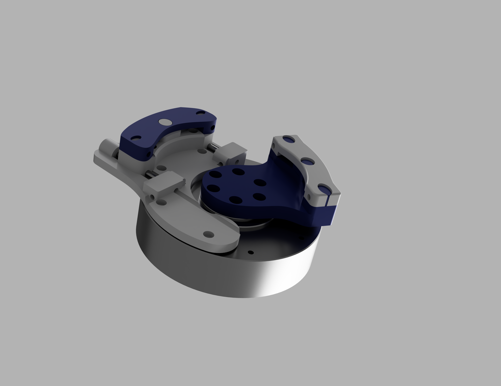

# Active-Knee-Orthosis

# The AIROB Active-Knee-Orthosis
Welcome to the **Active-Knee-Orthosis** project by the AIROB-Lab! This README provides an overview of the designed hardware components, highlights the key changes made to improve manufacturability, cost-effectiveness, and functionality.

## Table of Contents

- [Project Overview](#project-overview)
- [Key Hardware Design Changes](#key-hardware-design-changes)
  - [Modular Design](#modular-design)
  - [Standardized Components](#standardized-components)
  - [Manufacturability Enhancements](#manufacturability-enhancements)
  - [Material Optimization](#material-optimization)
  - [Cost Reduction Strategies](#cost-reduction-strategies)
  - [Durability and Safety Improvements](#durability-and-safety-improvements)
- [Compliance with CERN-OHL-P-2.0](#compliance-with-cern-ohl-p-20)
- [Getting Started & Contributing](#getting-started--contributing)
- [Acknowledgments](#acknowledgments)
- [License](#license)

## Project Overview

The Active-Knee-Orthosis
 

## Key Hardware Design Changes

### Components

- **Off-the-Shelf Parts:** 
All the parts mentioned were attached to the orthosis [GENUDYN®CI STEP THRU](https://www.sporlastic.de/en/product/item/genudyn-ci-step-thru/) of Sportlastic. It is a knee brace with dynamic stabilisation. 
For powering the device the [AK80-9 CubeMars T-Motor](https://www.mabrobotics.pl/product-page/ak80-9) was used.

- **3D printed Parts:** 
Added to the knee brace are the 3D printed parts linked in the sources.
When printing an infill density of minimum 50 is recommended. For better mechanical strength the parts should be printed in a direction so that the pins are aligned parallel to the built plate.

### Manufacturing
- **Assembling of 3D parts:** 
The top_clip_inner and top_clip_outer are connected 

### Material Optimization

- **Increased Material Variety:** The redesign incorporates a broader range of readily available materials, balancing durability and cost-effectiveness. Titanium adapters replace aluminum components where greater strength is required.
- **Wall Thickness Adjustments:** Wall thickness has been increased in necessary areas to ensure structural integrity while allowing for the use of less expensive materials like Al 5055 instead of higher-grade alloys.

### Cost Reduction Strategies

- **Reduced Manufacturing Time:** Simplifying component geometries and standardizing parts have led to a 40-70% reduction in manufacturing time and costs.
- **Minimized Labor Costs:** By replacing complex assemblies with simplified, all-in-one solutions, labor costs associated with machining and assembly have been significantly reduced.
- **Affordable Bearings and Maintenance:** Standard bearings are used instead of ultra-thin variants, lowering initial costs. Design features facilitate easier bearing replacement, promoting a maintenance strategy that prioritizes long-term cost-efficiency.

### Durability and Safety Improvements

- **Enhanced FEA Safety Factors:** Finite Element Analysis (FEA) confirms a safety factor of at least 1.107 under static loads, a substantial improvement over the original OSL 2.0 design. This ensures the prosthesis maintains structural integrity under expected usage conditions.
- **Robust Housing Design:** The housing has been redesigned to eliminate failure points identified in the original model, incorporating features that distribute loads more effectively and enhance overall durability.

## Compliance with CERN-OHL-P-2.0

The OSL 2.0 hardware design complies with the CERN Open Hardware License Permissive version 2.0 (CERN-OHL-P-2.0), ensuring that:

- **Open Access:** All design files, schematics, and documentation are openly available for use, modification, and distribution.
- **Attribution:** Proper attribution is maintained, acknowledging the original creators and contributors to the project.
- **No Additional Restrictions:** The design does not impose any additional restrictions beyond those specified in the CERN-OHL-P-2.0, promoting free and open collaboration.

For full details on licensing terms, please refer to the [LICENSE](LICENSE) file included in this repository.

## Getting Started & Contributing

To build or modify the Active-Knee-Orthosis, follow the instructions from  .
Contributions to the OSL 2.0 project are welcome, following the community guidelines!
Please adhere to the [Department Artificial Intelligence in Biomedical Engineering](https://www.airob.tf.fau.de/) of the FAU licensing terms when contributing.

## Acknowledgments

We extend our gratitude to the personnel of the Mechanics Workshop of the Faculty of Engineering at Friedrich-Alexander-Universität Erlangen-Nürnberg for their support and expertise. Special thanks to our research collaborators and the open-source community for their invaluable feedback and contributions.

## License

This project is licensed under the [CERN Open Hardware License Permissive version 2.0](https://www.ohwr.org/project/cernohl). See the [LICENSE](LICENSE) file for more details.

---

For any questions or further information, please contact the corresponding author at [marc.scheidl@fau.de](mailto:marc.scheidl@fau.de).